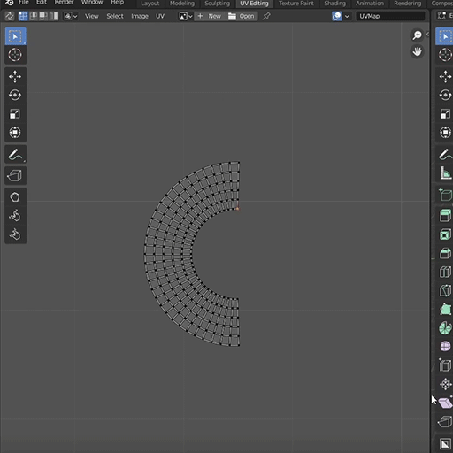
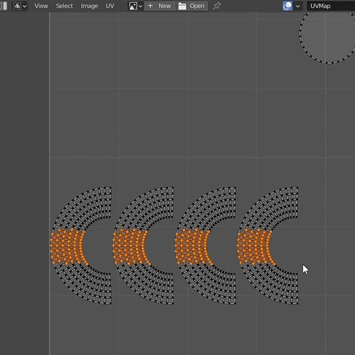

# SweetRoll UV Unroller (Blender Addon)
Helping Old Lady Palmer one UV island at a time

Do you strongly dislike straightening your rolled-up uv islands in blender? Are you tired of having to use follow active quads to re-unwrap your curved uv islands to attempt to straighten them out? Well now you will never manually straighten your curved uvs again with SweetRoll™!!!

Just select a vertex in the UV editor, right-click and select "Sweet (Un)roll" and your semi-circular uv strip will be straight in the blink of an eye!

Version 1.1.1
Works with Blender 3.x (Confirmed functional for 3.1)

## Installation

Download the zip file in the blender plugin directory
Install the addon in Blender by going to Preferences > Add-ons > Install and installing the sweetroll.zip file

## Usage

Select 1 or more uvs on the uv island(s) you want to unroll. Right click and select Sweet(un)roll

You can also select many islands at once.

## Notes
- The command will only work for islands that are made entirely of quads
- It will not work on cyclical loops
